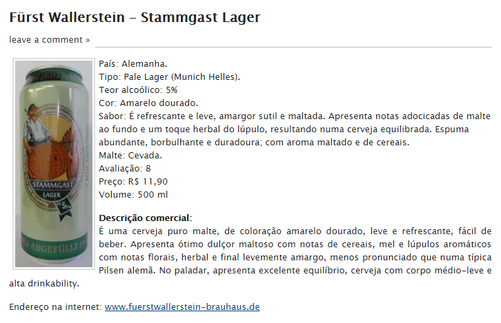

```{r setup, echo=FALSE, message=FALSE, warning=FALSE}
# setup
library(knitr)

# default behavior for chunks
knitr::opts_chunk$set(echo = TRUE)
knitr::opts_chunk$set(warning = FALSE)
knitr::opts_chunk$set(message = FALSE)
knitr::opts_chunk$set(cache = TRUE)
```


Neste post vamos explorar a análise de textos extraítos via _data scraping_ de um blog de avaliações de cerveja para encontrar  

<!--more-->

## Base de dados com avaliação das cervejas

O primeiro passo é obter os dados descritivos das cervejas. Como não existe uma em português dando sopa por aí, a estratégia e buscar algum site de avaliação de cervejas, com uma boa quantidade de informações e extrair os dados de lá, montando uma base própria.

### Data Scraping das avaliações

**Data scraping** (do inglês, raspagem de dados) é uma técnica computacional na qual um programa extrai dados de saída legível somente para humanos, proveniente de um serviço ou aplicativo. Os dados extraídos geralmente são minerados e estruturados em um formato padrão como CSV, XML ou JSON.

**Rvest**[^4] é um pacote que facilita o _scraping_ de dados de páginas web html. Ele é projetado para trabalhar com _magrittr_ para que você possa expressar operações complexas como pipelines facilmente compreendidos.

Com possibilidade de aplicar _seletores CSS_[^5] para capturar elementos específicos e pré-tratamento de listas e tabelas.

### Blog Cerva Nossa

Usaremos o [blog Cerva Nossa](https://cervanossa.wordpress.com) como fonte para uma descrição das cervejas. O M. Nogueira, autor dos posts do blog, sempre avalia 9 aspectos: País, Tipo, Teor Alcoólico, Cor, Sabor, Malte, Avaliação, Preço e Volume, além da descrição comercial, da imagem da mesma e um link para o site da cervejaria.



Embora as informações estejam num corpo de texto corrido dentro do post, ou seja, não é possível capturá-las individualmente usando um seletores de CSS, o fato do post ter sempre o mesmo formato facilita o tratamento de strings.

```{r scrapLibs}

# pacotes usados no scrap
library(rvest)     # scrap package
library(stringr)   # manipulacao de strings
library(tidyverse) # pipe, maps and tibble
library(lubridate) # manipulacao de datas

```

O blog gerado em _wordpress_ divide o site em _pages_ e cada uma delas contém 7 posts. A idéia é montar uma função para processar uma página por vez e chamá-la para as diversas páginas do site

```{r scrapFunction}

# funcao que recebe a url da pagina e processa os posts
scrapBeerPage <- function(base.url) {

  # logging
  print(paste0("Scrapping: ", base.url))
  
  # faz o fetch da url e estrutura em um html doc (xml)
  html_doc <- read_html(base.url)
  
  # extração do nome da cerveja que está no título do post,
  # dentro do link para o próprio post
  html_doc %>% 
    html_nodes("div .post") %>%         # div que contem o post
    html_nodes("h2 a:first-child") %>%  # primeiro link do post em um H2
    html_text() %>%                     # pega o texto da tag
    str_replace("\u00A0"," ") %>%       # no nome há &nbsp; e &#8209;
    str_replace("\u2011","-") %>%       # removendo
    as.tibble() %>%                     # transforma em tibble
    rename(nome.completo=value) %>%     # nome completo
    mutate(
      # o nome está composto por "cervejaria - cerveja" criamos colunas 
      # separadas para o valores
      cervejaria = str_split(nome.completo, " . ", simplify = T)[,1],
      cerveja = str_split(nome.completo," . ", simplify = T)[,2]
    ) -> beers.name

  # mesmo CSS seletor do nome para capturar o link para a valiacao
  html_doc %>% 
    html_nodes("div .post") %>%
    html_nodes("h2 a:first-child") %>%
    html_attr("href") %>%               # busca o href dentro da <a ...
    as.tibble() %>%
    rename(link.avaliacao=value) -> beers.eval_link

  # captura o link para a imagem da cerveja
  # geralmente o primeiro  dentro do post
  html_doc %>% 
    html_nodes(".main") %>% 
    map(function(x){
      html_node(x,"img") %>% 
        html_attr("src") %>%
        head(1)        
    }) %>%
    # a url está acompanhada de uma query string - limpando
    str_replace("\\?.*","") %>% 
    as.tibble() %>% 
    rename(image=value) -> beers.image
  
  # captura a avaliação: ela é um "texto corrido" dentre de um <p>,
  # que está dentro do div do post (main)
  # pode vir outros textos de outros p's 
  html_doc %>%
    html_nodes(".main p") %>%
    html_text() %>%
    # so me interessa o texto que contiver "País: "
    map( ~Filter(function(x) str_count(x,"País: ")>0,.) ) %>% 
    # cada atributo classificado está numa linha (/n)
    unlist() %>% str_split("\n") %>%
    # extrai os valores dos atributos que estão como pares "chave:valor"
    # por exemplo: País: Brasil /n Tipo: Lagger/m
    map(function(texts){
      str_replace(texts, ".+: ", "") %>%
        str_replace(.,"\\.+$","") %>%
        # somente nove atributos, há algumas "obs:" em alguns posts
        head(9) 
    }) %>%
    unlist() %>% as.vector() %>%
    matrix(ncol=9, byrow = T) %>%
    # convert em tibble e "re-seta" os nomes dos atributos
    as.tibble() %>% 
    setNames(c("pais","tipo","alcool",
               "cor","sabor","malte",
               "avaliacao","preco","volume")) -> beers.eval
  
  # captura o link para o site da cervejaria
  # geralmente dentre de um "<a...>" no último <p> do post
  html_doc %>%
    html_nodes(".main p:last-of-type") %>% 
    map(function(x){
      link <- html_nodes(x,"a:first-child")
    }) %>%
    # nem todo post tem link para a cervejaria
    # e alguns tem mais de um
    # então esse map volta NA quando não encontrar o link no post
    map(function(x){
      if (length(x)>0) { html_attr(x,"href") }
        else {return(NA)}
    }) %>% unlist() %>%
    as.tibble() %>% 
    rename(url=value) -> beers.url
  
  # captura a data de avalicao
  # Está no último "p" de uma "div" com class "signature"
  html_doc %>%
    html_nodes(".signature p:last-of-type") %>%
    html_text() %>%
    dmy_hm() %>%     # convert para data.hora
    as.tibble() %>%
    rename(data.avalicao=value) -> beers.eval_date
  
  # combina os dados extraídos em um único tibble
  bind_cols( beers.name, beers.eval, beers.eval_date,
             beers.eval_link, beers.url, beers.image) %>% return()

}

```

A função retorna um tibble com os dados dos posts de cada página, bastando então chamar a função repetidamente para todas as páginas do site (hoje, 203 páginas)

```{r scrapSite, eval=FALSE}

# url base do blog e sequencia de paginas
base.url <- "https://cervanossa.wordpress.com/"
pages <- 1:203

# percorre as paginas fazendo o scrap
pages %>%                                    
  paste0(base.url, "page/", .) %>%
  map_df(possibly(scrapBeerPage,NULL)) -> raw_beers

# salva localmente para não precisar reprocessar toda hora
saveRDS(beers,"./data/raw_beers.rds")

# quantas avaliacoes foram capturadas ?
dim(raw_beers)

```

```{r restoreBeersSaved, echo=FALSE}
# lendo de uma base pré salvada para não ter que
# processar o blog a cada vez que renderizo esse Rmarkdown
raw_beers <- readRDS("./data/beer_tm/raw_beers.rds")
dim(raw_beers)
```

Possivelmente nem todos os posts serão exatamente iguais, então pode ser que algum deles possa algum formato que impessa o processamento do site todo, gerando uma falha, para evitar a interrupção usamos o `purrr::possibly()`. Essa função permite evitar que uma falha no scrap de uma página pare o processo, em vez de falhar, volta-se um resultado nulo para aquela página, e que não será concatenado pelo `purrr::map_df`, e o processo continua para as demais.

O procedimento correto, seria olhar cada caso de falha e alterar a função de scrap para tratá-las, ou então "desviar" as páginas que falharam para rotinas que as tratam especificamente. Fiz isso para boa parte do site, mas não para ele todo neste post.

Feita a extração vamos apenas arrumar a tipagem das colunas (já que tudo veio como "char" do html) e salvar localmente o resultado.

```{r columnType}

# ajustando as tipagens de algumas colunas
raw_beers %>%
  mutate(
    # corrigindo os tipos 'cervejaria', 'pais' e 'avalicao'
    cervejaria = as.factor(cervejaria), 
    pais = as.factor(pais),             
    avaliacao = as.integer(avaliacao),  
    # transformando o teor alcoólico de texto "6.5%" para num "0.065"
    alcool = as.numeric(str_replace(str_replace(alcool,"%",""),",","."))/100) %>%
  mutate(
    # criando uma estrutura de tipos e subtipos
    super.tipo = str_replace(tipo, " +\\(.+\\).*", ""),
    sub.tipo   = str_match(tipo, "\\(([^)]+)\\)")[,2]
  ) %>%
  # o autor sempre dá uma nota para a cerveja
  # se durante o casting houve um NA então o scrap nao tinha sido 
  # feito corretamente, retiramos esse registro
  filter( !is.na(alcool) ) -> beers

dim(beers)
```

Aproveitamos e criamos duas informação derivadas de tipo: `super.tipo` e `sub.tipo`. O autor do blog sempre classifica as cervejas com base em uma hierarquia de dois níveis, colocando nível mais específico dentro de um parênteses. Vamos derivar essa estrutura extraíndo e separando essas informações.

```{r typeSubtype}

# vendo uma parte dessa hierarquia
beers %>%
  select(tipo, super.tipo, sub.tipo) %>%
  head(10) %>%
  kable()

```

Agora nós temos uma boa base de avaliações, com mais de mil cervejas avaliadas.

```{r beersOverview}

# contando tipo, subtipos e supertipos
num_sprtp <- unique(beers$super.tipo) %>% length()
num_subtp <- unique(beers$sub.tipo) %>% length()
num_tipo  <- unique(beers$tipo) %>% length()

# overview do dataset
head(beers,10) %>%
  select(-nome.completo, -sabor) %>% # tira alguns campos para visualizacao
  select(1:10) %>%
  kable()

```

São `r num_sprtp` tipos de cervejas diferentes combinados com `r num_subtp` sub.tipos, formando `r num_tipo` combinações diferentes.

```{r beersTypes}

# 10 tipos de cerveja mais avaliados 
beers %>%
  count(super.tipo, sub.tipo, sort=T) %>% 
  head(10) %>%
  kable()

```


[^1]: R Package para _Stemming_ em Português  - https://cran.r-project.org/web/packages/ptstem/vignettes/ptstem.html

[^2]: _stop words_ para português  - https://gist.github.com/alopes/5358189

[^3]: Beer Text Mining with Tidytext - http://kaylinwalker.com/tidy-text-beer/

[^4]: Tutoriais de **rvest**
 - https://stat4701.github.io/edav/2015/04/02/rvest_tutorial/
 - https://www.analyticsvidhya.com/blog/2017/03/beginners-guide-on-web-scraping-in-r-using-rvest-with-hands-on-knowledge/
 
[^5]: CSS Selectors - https://www.w3schools.com/cssref/css_selectors.asp

[^6]: Tidy Text Mining Beer Review - http://kaylinwalker.com/tidy-text-beer/