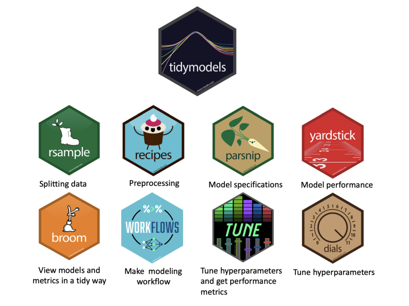

"The only way to learn mathematics is to do mathematics." - Paul Halmos. Taking time out of the day-to-day rush to finally learn how to use `{tidymodels}` for machine learning. These are the notebooks that I did to enter in this universe.

<!--more-->

Better later than never. I take a time to finally learn how to use [`{tidymodels}`](https://www.tidymodels.org/) for machine learning. Tidymodels is a set of packages that replaces the [`{caret}`](http://topepo.github.io/caret/index.html) package as a ML framework to cover various aspects of the pipeline and try to standardizing the use of many different algorithms.

It's powerful set of packages, but also with a very different APIs and design principles, so I have to stop and learn how to use doing some scripts to test the several packages of this universe. This one bellow is the "simplest case" and a put other cases in my [GitHub](https://github.com/GiulSposito/myTidymodels).



## The Simplest Pipeline

## Intro

The simplest steps to make a straightforward ML pipeline using [`{tidyverse}`](https://www.tidymodels.org/) packages follows these steps:

1. use [`{rsample}`](https://rsample.tidymodels.org/) to split the dataset between training and testing subsets
1. use [`{recipes}`](https://recipes.tidymodels.org/) to make some data preprocessing script
1. use [`{parsnip}`](https://parsnip.tidymodels.org/) to define a **ranger random forest** model
1. put the recipe and the model in a [`{workflow}`](https://workflows.tidymodels.org/) object
1. fit a model using the training subset
1. use the fitted model to make a prediction
1. use [`{yardstick}`](https://yardstick.tidymodels.org/) the check the model performance

### Packages

```{r setup, warning=FALSE, message=FALSE}
library(tidymodels)  
library(mlbench)    # mlbench is a library with several dataset to perform ML training
library(skimr)      # to look the dataset

# loading "Boston Housing" dataset
data("BostonHousing")
```

### Dataset: Boston Housing Dataset

Housing data contains 506 census tracts of Boston from the 1970 census. The dataframe BostonHousing contains the original data by Harrison and Rubinfeld (1979), the dataframe BostonHousing2 the corrected version with additional spatial information.

You can include this data by installing mlbench library or download the dataset. The data has following features, medv being the target variable:

+ crim - per capita crime rate by town
+ zn - proportion of residential land zoned for lots over 25,000 sq.ft
+ indus - proportion of non-retail business acres per town
+ chas - Charles River dummy variable (= 1 if tract bounds river; 0 otherwise)
+ nox - nitric oxides concentration (parts per 10 million)
+ rm - average number of rooms per dwelling
+ age - proportion of owner-occupied units built prior to 1940
+ dis - weighted distances to five Boston employment centers
+ rad - index of accessibility to radial highways
+ tax - full-value property-tax rate per USD 10,000
+ ptratio- pupil-teacher ratio by town
+ b 1000(B - 0.63)^2, where B is the proportion of blacks by town
+ lstat - percentage of lower status of the population
+ medv - median value of owner-occupied homes in USD 1000’s

```{r dataoverview}
BostonHousing %>% 
  skim()
```

We'll try to predict **medv** (median value of owner-occupied homes).

### Step 1: Training & Testing Datasets

```{r split}
boston_split <- initial_split(BostonHousing)
boston_split
```

### Step 2: Data Preprocessing

```{r preprocRecipe}
recp <- BostonHousing %>% 
  recipe(medv~.) %>%                               # formula goes here
  step_nzv(all_predictors(), -all_nominal()) %>%   # remove near zero var
  step_center(all_predictors(),-all_nominal()) %>% # center 
  step_scale(all_predictors(),-all_nominal()) %>%  # scale
  step_BoxCox(all_predictors(), -all_nominal())    # box cox normalization
recp
```

### Step 3: Model Specification

```{r model}
model_eng <- rand_forest(mode="regression") %>% 
  set_engine("ranger")
model_eng
```

### Step 4: Put all together in a Workflow

```{r wf}
wf <- workflow() %>% 
  add_recipe(recp) %>%  # preprocessing specification (with formula)
  add_model(model_eng)  # model specification
wf
```

### Step 5: Training the model

```{r fit}
# the  do all by itself
# calculates the data preprocessing (recipe)
# apply to the training set
# fit the model using it
model_fit <- fit(wf, training(boston_split)) 
model_fit
```

### Step 6: Make some predictions

```{r pred}
# the prediction applied on the fitted  automatically
# apply the trained transformation on the new dataset
# and predict the output using the trained model
y_hat <- predict(model_fit, testing(boston_split))
head(y_hat)
```

### Step 7: Evaluate the model performance

```{r eval}
y_hat %>% 
  bind_cols(testing(boston_split)) %>% # binds the "true value"
  metrics(truth=medv, estimate=.pred)  # get the estimation metrics (automatically)
```

## Other Cases

I create a [GitHub](https://github.com/GiulSposito/myTidymodels) with with others notebooks that I did to learn to use the Tidymodels package and to serve as a reference guide to myself:


- [Simplest Tidymodel WF](https://github.com/GiulSposito/myTidymodels/blob/main/Rmd/simplest_wf.md): straightforward ML  with tidymodels
- [Regression Pipeline Building Blocks](https://github.com/GiulSposito/myTidymodels/blob/main/Rmd/tidymodels_regression_walkthrough.md): understanding the building blocks of tidymodel ML pipeline 
- [Classification Pipeline Building Blocks](https://github.com/GiulSposito/myTidymodels/blob/main/Rmd/tidymodels_classification_walkthrough.md): understanding the use of worklfow.
- [Hyper Parameter Tunning](https://github.com/GiulSposito/myTidymodels/blob/main/Rmd/tidymodels_tunning_hyperparameters.md): understanding Cross Validation and Hyperparameter Tuning.

## Full Code

```{r warning=FALSE, message=FALSE, eval=FALSE}
library(tidymodels)  
library(mlbench)    # mlbench is a library with several dataset to perform ML training
library(skimr)      # to look the dataset

# loading "Boston Housing" dataset
data("BostonHousing")

# data overview
BostonHousing %>% 
  skim()

# split 
boston_split <- initial_split(BostonHousing)

# recipe: preprocessing script
recp <- BostonHousing %>% 
  recipe(medv~.) %>%                               # formula goes here
  step_nzv(all_predictors(), -all_nominal()) %>%   # remove near zero var
  step_center(all_predictors(),-all_nominal()) %>% # center 
  step_scale(all_predictors(),-all_nominal()) %>%  # scale
  step_BoxCox(all_predictors(), -all_nominal())    # box cox normalization

# Model Specification

model_eng <- rand_forest(mode="regression") %>% 
  set_engine("ranger")

# Workflow

wf <- workflow() %>% 
  add_recipe(recp) %>%  # preprocessing specification (with formula)
  add_model(model_eng)  # model specification

# Training the model with workflow
# the  do all by itself  calculates the data preprocessing (recipe)
# apply to the training set fit the model using it
model_fit <- fit(wf, training(boston_split)) 

# Predict
y_hat <- predict(model_fit, testing(boston_split))
head(y_hat)

# Evaluate
y_hat %>% 
  bind_cols(testing(boston_split)) %>% # binds the "true value"
  metrics(truth=medv, estimate=.pred)  # get the estimation metrics (automatically)
```

