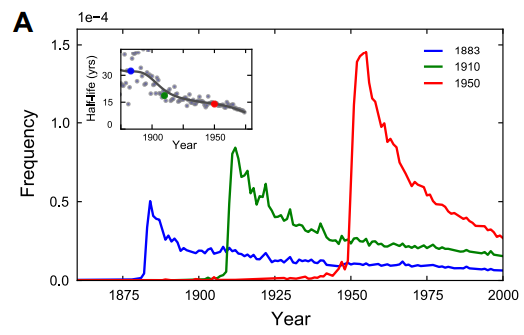

In a widely discussed paper, [Michel and colleagues (2011)](https://dash.harvard.edu/bitstream/handle/1/8899722/MichelScience2011.pdf) analyzed the content of more than five million digitized books in an attempt to identify long-term cultural trends. The data that they used has now been released as the Google NGrams dataset, and so we can use the data to replicate and extend some of their work.

<!--more-->

This post is based in one exercise of Matthew J. Salganik's book [Bit by Bit: Social Research in the Digital Age](https://www.amazon.com/Bit-Social-Research-Digital-Age/dp/0691158649), from chapter 2.

In a widely discussed paper, [Michel and colleagues (2011)](https://dash.harvard.edu/bitstream/handle/1/8899722/MichelScience2011.pdf) analyzed the content of more than five million digitized books in an attempt to identify long-term cultural trends. The data that they used has now been released as the Google NGrams dataset, and so we can use the data to replicate and extend some of their work.

```{r setup, echo=FALSE, message=FALSE, warning=FALSE}
library(tidyverse)
library(glue)
```


In one of the many results in the paper, Michel and colleagues argued that we are forgetting faster and faster. For a particular year, say “1883,” they calculated the proportion of 1-grams published in each year **between 1875 and 1975** that were “1883.” They reasoned that this proportion is a measure of the interest in events that happened in that year. In their figure 3a, they plotted the usage trajectories for three years: 1883, 1910, and 1950. These three years share a common pattern: little use before that year, then a spike, then decay.

Next, to quantify the rate of decay for each year, Michel and colleagues calculated the “half-life” of each year for all years between 1875 and 1975. In their figure 3a (inset), they showed that the half-life of each year is decreasing, and they argued that this means that we are forgetting the past faster and faster. They used version 1 of the English language corpus, but subsequently Google has released a second version of the corpus. 



This activity will give you practice writing reusable code, interpreting results, and data wrangling (such as working with awkward files and handling missing data). This activity will also help you get up and running with a rich and interesting dataset.

#### Part A

Get the [raw data](http://storage.googleapis.com/books/ngrams/books/googlebooks-eng-all-1gram-20120701-1.gz) from the Google Books NGram Viewer website (http://storage.googleapis.com/books/ngrams/books/datasetsv2.html). In particular, you should use version 2 of the English language corpus, which was released on July 1, 2012. Uncompressed, this file is 1.4 GB. 

```{r import, eval=FALSE}
library(tidyverse)
library(glue)

# traditional CSV "tab separated" (it's big)
raw1gram <- read_delim("./googlebooks-eng-all-1gram-20120701-1.txt", delim = "\t",
                       col_names = c("ngram","year","match_count","volume_count"),
                       col_types = "ciii")

# lets see
head(raw1gram) %>% 
  knitr::kable()
  
```


```{r readData, echo=FALSE, warning=FALSE, message=FALSE, cache=TRUE, cache.lazy = FALSE}
# traditional CSV "tab separated" (it's big)
raw1gram <- readRDS("./raw1gram.rds")

# lets see
head(raw1gram) %>% 
  knitr::kable()
```

#### Part B

Recreate the main part of figure 3a of Michel et al. (2011). To recreate this figure, you will need two files: the one you downloaded in part (a) and the [“total counts” file](http://storage.googleapis.com/books/ngrams/books/googlebooks-eng-all-totalcounts-20120701.txt), which you can use to convert the raw counts into proportions. Note that the total counts file has a structure that may make it a bit hard to read in. Does version 2 of the NGram data produce similar results to those presented in Michel et al. (2011), which are based on version 1 data?

```{r importTotalCount, warning=FALSE, message=FALSE}

# totalcount has an unique line, with registers separated by "tab" and columns
# separated by "," (WTF?)
totalCount <- tibble(
    # read this line an put in a tibble (one row, one column)
    txt = str_trim(read_lines("./googlebooks-eng-all-totalcounts-20120701.txt"))
  ) %>% 
    # separates into rows
    separate_rows(txt, sep="\t") %>% 
    # separate into columns
    separate(txt, sep = ",", 
             into = c("year","match_count","page_count","volume_count"),
             convert = T)

# lets see
head(totalCount) %>% 
  knitr::kable()

```


```{r repoFig3A}

# let's filter the dataset
fig3a <- raw1gram %>% 
  # taking some years
  filter(year>=1850, year <= 2000) %>% 
  select(ngram, year, ngram_count=match_count) %>% 
  # the selected years "1grams"
  filter(ngram %in% c("1883","1910", "1950")) %>% 
  # join with totalCount and calculates the frequency
  inner_join(totalCount, by="year") %>% 
  mutate(frequency=ngram_count/match_count) 

# plot it
fig3a %>% 
  select(ngram, year, ngram_count, frequency) %>% 
  ggplot(aes(x=year, y=frequency, color=ngram)) +
  geom_line(size=1) +
  theme_light()

```


#### Part C

Now check your graph against the [graph created by the NGram Viewer](https://books.google.com/ngrams/graph?content=1883%2C1910%2C1950&year_start=1850&year_end=2000&corpus=26&smoothing=0) (https://books.google.com/ngrams).

#### Part D

Recreate figure 3a (main figure), but change the y-axis to be the raw mention count (not the rate of mentions).

```{r fig3Count}
# plotting the ngram_count instead frequency
fig3a %>% 
  select(ngram, year, ngram_count, frequency) %>% 
  ggplot(aes(x=year, y=ngram_count, color=ngram)) +
  geom_line(size=1) +
  theme_light()

```

#### Part E

Does the difference between (b) and (d) lead you to reevaluate any of the results of Michel et al. (2011). Why or why not?

> Well, are the years really forgotten?

#### Part F

Now, using the proportion of mentions, replicate the inset of figure 3a. That is, for each year **between 1875 and 1975**, calculate the half-life of that year. **The half-life is defined to be the number of years that pass before the proportion of mentions reaches half its peak value**. Note that  Michel et al. (2011) do something more complicated to estimate the half-life (see section III.6 of their Supporting Online Information) but they claim that both approaches produce similar results. Does version 2 of the NGram data produce similar results to those presented in Michel et al. (2011), which are based on version 1 data? (Hint: Don’t be surprised if it doesn’t.)

```{r halfLife}

half_life <- raw1gram %>% 
  select(ngram, year, ngram_count=match_count) %>% 
  # selects only the ngrams of 'years' and counting after 1950
  filter(ngram %in% as.character(1875:2012), year>=1850) %>% 
  # to make it easy, converts the year-grams into integer
  mutate(ngram = as.integer(ngram)) %>% 
  # off course gets only counting 'after' (year) that specific year (ngram)
  filter(year>=ngram) %>% 
  # join totalCount and calculates the frequency
  inner_join(select(totalCount, year, total_count=match_count), by="year") %>% 
  mutate(frequency=ngram_count/total_count) %>% 
  # for each year (ngram)
  group_by(ngram) %>% 
  # find the "max peak" and calculates actual frequency
  mutate( peak_freq = max(frequency) ) %>% 
  ungroup()

# We want eliminates "half-peaks" before the peaks
half_life <- half_life %>% 
  # find the "peak year"
  filter(peak_freq==frequency) %>% 
  select(ngram, peak_year=year) %>% 
  inner_join(half_life, by="ngram") %>% 
  filter(year >= peak_year) %>% 
  # filter when the frequency is at half (or bellow) the peak
  filter( frequency <= peak_freq/2 ) %>% 
  group_by( ngram ) %>% 
  # get the first year which this occurs
  filter( year == min(year) ) %>% 
  ungroup() %>% 
  mutate( half_life = year-ngram )

half_life %>% 
  ggplot(aes(x=ngram, y=half_life)) +
  geom_point() +
  theme_light()

```


#### Part G

Were there any years that were outliers, such as years that were forgotten particularly quickly or particularly slowly? Briefly speculate about possible reasons for that pattern and explain how you identified the outliers. 

```{r hlIsNormal, warning=FALSE, message=FALSE}
# what is a half_life?
summary(half_life$half_life)

# Lets check what is an outlier
# the half life has an normal distribution?
half_life %>% 
  ggplot(aes(x=half_life)) +
  geom_histogram() +
  theme_light()

# its normal distributed?
shapiro.test(half_life$half_life)
```

Let's use two standard deviations (~95% of the points) around the mean as "regular half life" values.

```{r ci95}

upper_limit <- mean(half_life$half_life) + 2*sd(half_life$half_life)
lower_limit <- mean(half_life$half_life) - 2*sd(half_life$half_life)

# year forgotten quickly
half_life[which(half_life$half_life < lower_limit),] %>% 
  select(ngram, half_life)
```

It's strange that 1918 (last year of WW I, and the year of russian revolution) and 1942 (a year in the WW II) are easily forgotten.

```{r slowlyFog}
# year forgotten slowly?
half_life[which(half_life$half_life > upper_limit),] %>% 
  select(ngram, half_life)

```

The 1900 is a "millennial" year, and 1910 was the year of the aviation (and comet Harley appearance), but I was thinking that the year of WWI and WWII was particularly slowly to forget. Let's compare:

```{r notableYears}

# the two outliers compare with the years of wars, 
# moon landing, fall of Berlin's wall, and of USSR?
half_life %>% 
  mutate(
    notable_year = ngram %in% c(1900, 1910, 1914:1918, 1939:1945, 1969, 1989, 1991, 2000),
  ) %>% 
  select(ngram, half_life, notable_year) %>% 
  ggplot(aes(x=ngram, y=half_life, color=notable_year)) +
  geom_point() +
  scale_color_manual(values=c("blue","red")) +
  geom_hline(yintercept = upper_limit, linetype="dashed") +
  geom_hline(yintercept = lower_limit, linetype="dashed") +
  ylim(0,max(half_life$half_life)) +
  theme_light()

```

## Extra

After doing the analyzes proposed by the book, I was intrigued if it was possible to reproduce the results of the original article using the original data (google ngram dataset v1) and how we could do this using R.

### Download and Importing the Dataset

First we need to download and load the data, unlike version 2, in the first version of the data the tokens of the years are spread over 10 CSV files, so it is necessary to download and import the data.

```{r importV1, eval=FALSE}

# download each one of 10 csv (zipped) files
downloaded_files <- 0:9 %>% 
  map(function(.x){
    download.file(
      glue("http://storage.googleapis.com/books/ngrams/books/googlebooks-eng-all-1gram-20090715-{.x}.csv.zip"),
      glue("./import/googlebooks-eng-all-1gram-20090715-{.x}.csv.zip"))
  })

# import only the "years" tokens from each of 10 csv files
raw1gram <- 0:9 %>% 
  map_df(function(.x){
    # traditional CSV "tab separated" (it's big)
    raw1gram <- read_delim(
      glue("./import/googlebooks-eng-all-1gram-20090715-{.x}.csv.zip"),
      delim = "\t",
      col_names = c("ngram","year","word.count","page.count","book.count"),
      col_types = "cinnn"
    )
    
    # keep only the tokens of interest
    raw1gram %>%
      filter( ngram %in% as.character(1850:2010) ) %>% 
      return()
  })

# store it to be used latter if necessary
saveRDS(raw1gram,"./data/ngrams_v1_years.rds")

# what we have
head(raw1gram) %>% 
  knitr::kable()
```

```{r realImportV1, echo=FALSE}
# read from imported files
raw1gram <- readRDS("./ngrams_v1_years.rds")
# what we have
head(raw1gram) %>% 
  knitr::kable()
```

As we did in the first analysis, we need the total word counting to calculates the frequency.

```{r importTotalV1}

# Import the csv file download from ngram dataset site
totalCounts <- read_delim("./googlebooks-eng-all-totalcounts-20090715.txt", 
                          delim="\t", skip=1, col_types = "innn",
                          col_names=c("year","total.words","total.pages","total.books"))

head(totalCounts) %>% 
  knitr::kable()

```

### Prepare the dataset

Let's prepare the data for analysis calculating the frequency

```{r prepV1}

# join the total counting and calculates the frequency
years <- raw1gram %>% 
  filter( ngram %in% 1850:2010 ) %>% 
  inner_join(totalCounts, by="year") %>% 
  select(ngram, year, word.count, total.words) %>% 
  mutate(word.freq = word.count/total.words)

head(years) %>% 
  knitr::kable()

```

Also, as we did in the first analysis, let's check if we can reproduce the `fig 3A` from the original article.

```{r}
years %>% 
  # taking the years of analysis
  filter(year>=1850, year <=2000) %>% 
  # filters the years of interest
  filter(ngram %in% c(1883,1910,1950)) %>% 
  # plot it
  ggplot(aes(x=year, y=word.freq, color=ngram)) +
    geom_line(size=1) +
    theme_light()

```

### Exponencial Decay

We will try to redo year half life calculation, but this time we will do this by fitting an exponential decay model for each `token year`, starting from its peak frequency.

First, let's slice each year data from its peak.

```{r sliceFromPeak}

# for each 'token year' find its peak in frequency
peaks <- years %>% 
  # the peak has to be in the "future" of that year
  filter( year >= as.integer(ngram) ) %>% 
  group_by(ngram) %>% 
  # which year each token year peaked
  filter( word.freq == max(word.freq) ) %>% 
  select(ngram, max.year=year, max.freq=word.freq) %>% 
  ungroup()

# let's see
head(peaks) %>% 
  knitr::kable()

# so we filter the frequency data from the peak of each token year
decay.data <- years %>% 
  inner_join(peaks, by="ngram") %>% 
  # remove years before peak
  filter( year >= max.year )

# what we have?
head(decay.data) %>% 
  knitr::kable()

# let's plot some random year to check if we got what we want
decay.data %>% 
  filter( ngram %in% as.character(sample(1850:1980, 10))) %>% 
  ggplot(aes(x=year, y=word.freq, color=ngram)) +
  geom_line()+
  theme_minimal()

```

Now, for each year we have the frequency decay from its peak, and yes, the data seems a exponential decay. So, let's calculates each year 'half-life'. To do so, we'll fit and exponential equation of this format:

$$ y(t) = y_f + (y_f-y_0) e^{- \alpha t} $$

We are interest in the $\alpha$ coefficient, the decay rate, from it we can get the year half-life:

$$ y(t) = Ce^{-\alpha t} $$

Calculating half-life:

$$ \frac{1}{2}C =  Ce^{-\alpha t}$$
$$ \frac{1}{2} =  e^{-\alpha t} $$

$$ ln(\frac{1}{2}) = -\alpha t $$

$$ t_{half-life} = -\frac {ln(\frac{1}{2})}{\alpha} $$

We'll use the function `SSasymp` to make the exponencial equation to use in `nls` function, this keep us to have to define initial values for $\alpha$, $y_0$ and $y_t$.

```{r calcHalfLife, warning=FALSE, message=FALSE, error=FALSE}

# create a funtion to fit an exp model and calc the half-life from it
calcHalfLife <- function(dt){
  
  # fit a exp model
  model <- nls(word.freq ~ SSasymp(year, yf, y0, log_alpha), data=dt)
  # by definition SSasymp uses "ln(alpha)" not alpha itself in the model
  alpha <- exp(coef(model)[3])
  halflife.val <- -log(1/2)/alpha
  names(halflife.val) <- "half.life"
  return(halflife.val)
}

# lets create a safer version because some year can't be fitted in the exp decay
sf_calcHalfLIfe <- safely(calcHalfLife, NA, quiet = T)

# lets apply the half-life function in your data for each year
hl <- decay.data %>% 
  group_by(ngram) %>% 
  nest() %>% 
  arrange(ngram) %>% 
  mutate( hl_calc = map(data, sf_calcHalfLIfe)) %>% 
  mutate( half_life = map_dbl(hl_calc, pluck, 1)) %>% 
  filter( !is.na(half_life) ) %>% 
  ungroup()

```

Finally, lets see how the years half-life progress along the time

```{r halflifePlot, warning=FALSE}

hl %>% 
  mutate(ngram=as.integer(ngram)) %>% 
  # years analyzed in the article
  filter(ngram >= 1850, ngram <= 1975 ) %>% 
  ggplot(aes(x=ngram, y=half_life)) + 
  geom_point() +
  ylim(0,100) +
  theme_minimal()


```

Well, the graph does not seem to be similar to the one found in the original article. Looking the plot, we can see that are a faster forgetfulness in the first year, the frequency of an year are mentioned decay at faster rate along the time, but this occurs only in the beginning.

After 1925 the years keep a constant half-life (and so, a constant decay rate), so by this data we are not forgetting faster.
